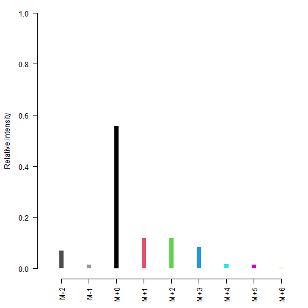
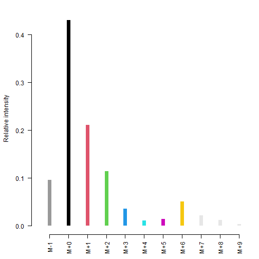

Please load the `CorMID` package before running the examples within this document.


``` r
library(CorMID)
```

# The CorMID function to correct superimposed mass isotopologue distributions of ^13^C labelled molecules in GC-APCI-MS flux experiments

The package provides the main function `CorMID` which will estimate the fragment distribution, *r*, and the mass isotopologue distribution, *M*, for a numeric vector of measured ion intensities originating from a compound analyzed by GC-APCI-MS (see below).

## Definitions

### Gas chromatography (GC)

Gas chromatography is an analytical method to separate volatile compounds.

### Atmospheric pressure chemical ionization (APCI)

Atmospheric pressure chemical ionization (APCI) is an ionization method used in mass spectrometry which utilizes gas-phase ion-molecule reactions at atmospheric pressure (10^5^ Pa) to convert molecules separated by GC into ions which can be analyzed by mass spectrometry.

### Mass spectrometry (MS)

Mass spectrometry is an analytical method to separate ions due to their mass, more specifically due to their difference in mass to charge ratio.

### Mass Isotopologue Distributions (MID)

Compounds which have the same sum formula are termed isomers. Isomers can be structurally different, *i.e.* the arrangement of the atoms in the molecules are different, or structurally identical. All isomers of a specific sum formula which are structurally identical but differ in their isotopic composition are termed isotopomers. The specific case of isotopomers with identical isotopic composition but differences of the position of these isotopes are termed isotopologues.

Let us look at an example: C~2~H~6~O would be a sum formula, with ethanol (CH~3~-CH~2~-OH) and dimethyl ether (CH~3~-O-CH~3~) being two structural isomers of C~2~H~6~O. The molecules ^13^CH~3~-CH~2~-OH and CH~3~-CH~2~-OH would be two isotopomers of ethanol as they differ in their isotopic composition. The molecules ^13^CH~3~-CH~2~-OH and CH~3~-^13^CH~2~-OH would be isotopologues of ethanol. Together, they represent the M1 isotopologue of ethanol with the common sum formula ^13^C^12^CH~6~O. The corresponding M2 isotopologue would be ^13^C~2~H~6~O. In mass spectrometry we measure the mass isotopologue distribution of C~2~H~6~O, more specifically of the structural isomer ethanol because we can separate other structural isomers during the chromatography preceding the measurement. Hence, the mass isotopologue distribution (MID) is an intensity vector of 3 different ion masses, M+0, M+1 and M+2. In this simple case of two carbons and neglecting ^17^O these three isotopologues represent only 4 different molecules. However, with increasing carbon number the situation is getting more complex. :)

### Helper functions

Within the main function `CorMID` we make use of several helper functions, *i.e.* `CountChemicalElements` and `CalcTheoreticalMDV`. The first one simply counts the digit following a certain letter in a chemical sum formula. Here, we use it to determine the number of carbon, silicon and sulfur atoms (neglecting nitrogen, as the ^15^N isotope is of low abundance). As the anticipated user will probably work on derivatized compounds, two additional letters were included to the chemical alphabet, **T** for TMS and **M** for a MEOX substitution. In consequence for compound Glucose (5 TMS, 1 MEOX) we would count:


``` r
fml <- "C6H12O6T5M1"
CorMID::CountChemicalElements(x = fml)
#>  C  H  O  T  M 
#>  6 12  6  5  1
```

and receive as output a named vector for all present elements. Specifying parameter *ele*, we can also count the occurence of a selection of elements.


``` r
CorMID::CountChemicalElements(x = fml, ele = c("C", "Si", "T", "Cl"))
#>  C Si  T Cl 
#>  6  0  5  0
```

The elements with a significant amount of natural occurring isotopes are relevant to calculate the theoretical mass distribution vector (or rather matrix respectively) of the compound. In the above example, the relevant elements are effectively carbon and silicon. 


```
#>    element isotope    mass abundance [%] abund > 1%
#> 1        H      1H  1.0078         99.99       TRUE
#> 2        H      2H  2.0141          0.01      FALSE
#> 3        C     12C 12.0000         98.93       TRUE
#> 4        C     13C 13.0034          1.07       TRUE
#> 5        O     16O 15.9949         99.76       TRUE
#> 6        O     17O 16.9991          0.04      FALSE
#> 7        O     18O 17.9992          0.21      FALSE
#> 8       Si    28Si 27.9769         92.22       TRUE
#> 9       Si    29Si 28.9765          4.69       TRUE
#> 10      Si    30Si 29.9738          3.09       TRUE
```

As we have 5 TMS groups, we need to consider in total 21 carbon (6 of biological origin and 15 in TMS groups) and 5 silicon atoms in our calculations.


``` r
fml <- "C21Si5"
td <- CorMID::CalcTheoreticalMDV(fml = fml)
round(td, 4)
#>       M+0    M+1    M+2    M+3    M+4    M+5    M+6
#> M0 0.5324 0.2561 0.1468 0.0464 0.0144 0.0032 0.0006
#> M1 0.0000 0.5385 0.2532 0.1457 0.0454 0.0141 0.0031
#> M2 0.0000 0.0000 0.5459 0.2508 0.1450 0.0445 0.0138
#> M3 0.0000 0.0000 0.0000 0.5593 0.2509 0.1458 0.0440
#> M4 0.0000 0.0000 0.0000 0.0000 0.5903 0.2585 0.1512
#> M5 0.0000 0.0000 0.0000 0.0000 0.0000 0.7007 0.2993
#> M6 0.0000 0.0000 0.0000 0.0000 0.0000 0.0000 1.0000
```

The first row of the matrix (M0) gives the relative amounts of all potential isotopes for C~21~Si~5~ assuming natural abundance conditions. The second row (M1) shows the relative amounts for isotopologue M1 (containing at least one ^13^C at any position). The final row (M6) shows the relative amounts when all biological carbon atoms are assumed to be ^13^C. The amount of biological carbon is estimated based on the amount of Si within the function (21 - 5 x 3 = 6). This might be overwritten by function parameters specifying the number of C of biological origin *nbio* and the number of measured ion signals above the detection limit *nmz*:


``` r
round(CorMID::CalcTheoreticalMDV(fml = fml, nbio = 21, nmz = 21)[-(5:19), -(5:19)], 4)
#>        M+0    M+1    M+2    M+3   M+19   M+20   M+21
#> M0  0.5324 0.2561 0.1468 0.0464 0.0000 0.0000 0.0000
#> M1  0.0000 0.5381 0.2531 0.1456 0.0000 0.0000 0.0000
#> M2  0.0000 0.0000 0.5439 0.2499 0.0000 0.0000 0.0000
#> M3  0.0000 0.0000 0.0000 0.5498 0.0000 0.0000 0.0000
#> M19 0.0000 0.0000 0.0000 0.0000 0.6781 0.1869 0.1350
#> M20 0.0000 0.0000 0.0000 0.0000 0.0000 0.7906 0.2094
#> M21 0.0000 0.0000 0.0000 0.0000 0.0000 0.0000 1.0000
```

Further, the package contains the convenience function `recMID` to reconstruct a measured MID based on a given *corMID,* *r* and sum formula. `recMID` returns an object of the similarly named class to allow easy visualization by a class dependent plot method.


``` r
fml <- "C9H20O3Si2"
mid <- c(0.9, 0, 0, 0.1)
r <- list("M+H" = 0.8, "M-H" = 0.1, "M+H2O-CH4" = 0.1)
rMID <- CorMID::recMID(mid = mid, r = r, fml = fml)
round(rMID, 4)
#>    M-2    M-1    M+0    M+1    M+2    M+3    M+4    M+5    M+6 
#> 0.0689 0.0139 0.5574 0.1203 0.1203 0.0846 0.0183 0.0142 0.0021 
#> attr(,"class")
#> [1] "recMID"
plot(rMID)
```



The spectrum shown in the above plot would be measured for lactic acid (2 TMS), assuming 10% of the fully labeled isotopologue M3, natural abundance, 10% proton loss and 10% of [M+H]+H~2~O-CH~4~. It is the task of `CorMID` to disentangle this overlay of superimposed MIDs and estimate both, *corMID* and *r*.

## Main function `CorMID`

### Idea

The problem in GC-APCI-MS that we try to overcome is the formation of fragments forming superimposed MIDs. The ones we identified so far are [M+H], [M+], [M+H]-H~2~ and [M+H]+H~2~O-CH~4~. If we assume [M+H] to be generally the most abundant and hence use it as our fix point (base MID, shift = 0), than we observe superimposed MIDs starting at -2, -1 and +2 relative to [M+H] for [M+], [M+H]-H~2~ and [M+H]+H~2~O-CH~4~ respectively.

The basic idea of the correction is that we measure a superimposed/composite MID of one to several fragments all derived from the same base MID. This base MID (or correct MID, *corMID*) is exactly what we are looking for. Estimating the *corMID* is complicated because we do not know the distribution of fragments, *i.e.* the amount of the individually occurring fragments or their ratios to each other respectively. Hence, we have to estimate the *corMID* and the ratio vector *r* which in combination fit our measurement best.

### Example

Lets start with an artificial Glucose spectrum where 10% is M6 labeled:


``` r
fml <- "C21Si5"
td1 <- CorMID::CalcTheoreticalMDV(fml = fml, nbio = 6, nmz = 8)
bMID <- c(0.9, rep(0, 5), 0.1)
md1 <- apply(td1*bMID, 2, sum)
round(md1, 4)
#>    M+0    M+1    M+2    M+3    M+4    M+5    M+6    M+7    M+8 
#> 0.4791 0.2305 0.1321 0.0418 0.0130 0.0029 0.0607 0.0250 0.0148
```

**md1** represents the measured isotopologue distribution which is equivalent to the vector of measured intensity values normalized to the vector sum. Please note that the measured MID contains additional peaks at M+7 and M+8, caused by the natural abundant isotopes of carbon atoms attached during derivatization. Now we may use function `CorMID` to disentangle this vector.


``` r
CorMID::CorMID(int=md1, fml=fml, r=unlist(list("M+H"=1)))
#> [class] 'CorMID'
#> MID [%] (estimated)
#>     M0    M1    M2    M3    M4    M5    M6
#>  89.84 00.00 00.00 00.00 00.00 00.00 10.16
#> [attr] 'r' (fixed)
#>   M+H
#>  1.00
#> [attr] 'err'
#> 0.002707
```

Notice, that we allowed only [M+H] to be present in option *r*. The result is a labeled vector representing the corrected MID (or base MID) and attributes providing information on the fitting error *err* and the parameters *r*atio, *ratio_status* and *mid_status* as used in the function call. Please note that during the function call *mid* was estimated and *r*atio was fixed.

We could achieve something similar testing for all currently defined fragments by omitting the *r* option:


``` r
CorMID::CorMID(int=md1, fml=fml)
#> [class] 'CorMID'
#> MID [%] (estimated)
#>     M0    M1    M2    M3    M4    M5    M6
#>  89.84 00.00 00.00 00.00 00.00 00.00 10.16
#> [attr] 'r' (estimated)
#>   M+H   M+   M-H   M+H2O-CH4
#>  1.00 0.00  0.00        0.00
#> [attr] 'err'
#> 0.002707
```

Here, we essentially get the same result as before (except for *ratio* related attributes) because there is no superimposition in our test data. *ratio* was estimated and other possible adducts were tested but found to be of zero presence.  Now lets generate more difficult composite data **md2** to be fit by including a 20% proton loss (or "[M+]" or "M-1", respectively) on top of **md1**.


``` r
md2 <- unlist(list("M-1" = 0, 0.8*md1)) + c(0.2*md1, 0)
round(md2, 4)
#>    M-1    M+0    M+1    M+2    M+3    M+4    M+5    M+6    M+7    M+8 
#> 0.0958 0.4294 0.2108 0.1140 0.0360 0.0109 0.0145 0.0536 0.0230 0.0119
```

We could have done the same with the convenience function *recMID*:


``` r
fml <- "C21Si5"
bMID <- c(0.9, rep(0, 5), 0.1)
r <- list("M+H" = 0.8, "M+" = 0.2)
rMID <- CorMID::recMID(mid = bMID, r = r, fml = fml)
round(rMID, 4)
#>    M-1    M+0    M+1    M+2    M+3    M+4    M+5    M+6    M+7    M+8    M+9 
#> 0.0960 0.4300 0.2111 0.1142 0.0361 0.0110 0.0138 0.0507 0.0218 0.0120 0.0035 
#> attr(,"class")
#> [1] "recMID"
plot(rMID, ylim=c(0,0.45))
```



and let `CorMID` decompose this back...


``` r
CorMID::CorMID(int=md2, fml=fml)
#> [class] 'CorMID'
#> MID [%] (estimated)
#>     M0    M1    M2    M3    M4    M5    M6
#>  89.84 00.00 00.00 00.00 00.00 00.00 10.16
#> [attr] 'r' (estimated)
#>   M+H   M+   M-H   M+H2O-CH4
#>  0.80 0.20  0.00        0.00
#> [attr] 'err'
#> 0.003209
```

which is pretty close to the truth. :)

### More Function Details

Finally, let's look into the mathematical details of the function. Apart from some sanity checks and data preparation steps done by the wrapper function `CorMID`, the main idea is to model a theoretical distribution based on a provided sum formula and fit a base MID and fragment ratios according to measurement data by function `FitMID` which is discussed in the following. The approach is brute force using two nested estimators for *r* and *corMID* separately. It builds on the idea to test a crude grid of parameters first, identify the best solution and use an iterative method minimizing the grid to approach the true value.

The grid is set by an internal function `poss_local`. Basically, if we have a two carbon molecule we expect a *corMID* of length=3 {M0, M1, M2}. Let's assume that *corMID* = {0.9, 0, 0.1}. Using a wide grid (step size d= 0.5) we would than test the following possibilities:


``` r
CorMID:::poss_local(vec=c(0.5,0.5,0.5), d=0.5, length.out=3)
#>   Var1 Var2 Var3
#> 1  1.0  0.0  0.0
#> 2  0.5  0.5  0.0
#> 3  0.0  1.0  0.0
#> 4  0.5  0.0  0.5
#> 5  0.0  0.5  0.5
#> 6  0.0  0.0  1.0
```

and identify {1, 0, 0} as best match after subjecting to a testing function. Taking the best match as our new starting point, we decrease the step size of the grid by 50% and test in the next iteration:


``` r
CorMID:::poss_local(vec=c(1,0,0), d=0.25, length.out=3)
#>    Var1  Var2  Var3
#> 1 1.000 0.000 0.000
#> 2 0.875 0.125 0.000
#> 3 0.750 0.250 0.000
#> 4 0.875 0.000 0.125
#> 5 0.750 0.125 0.125
#> 6 0.750 0.000 0.250
```

and will get closer to the truth and find {0.875, 0, 0.125} to give the lowest error.

In summary, using this approach we can approximate the optimal vectors of *corMID* and *r* in a finite number of iterations to reach a desired precision \<0.1%. We can nest MID fitting inside ratio fitting and thereby do both in parallel.

The error function currently employed is simply the square root of the summed squared errors, comparing the provided measurement data and a reconstructed MID based on a specific *corMID* and *r*.

## Wrap up

Thanks for following till the end. I hope this framework is helpful for you.
